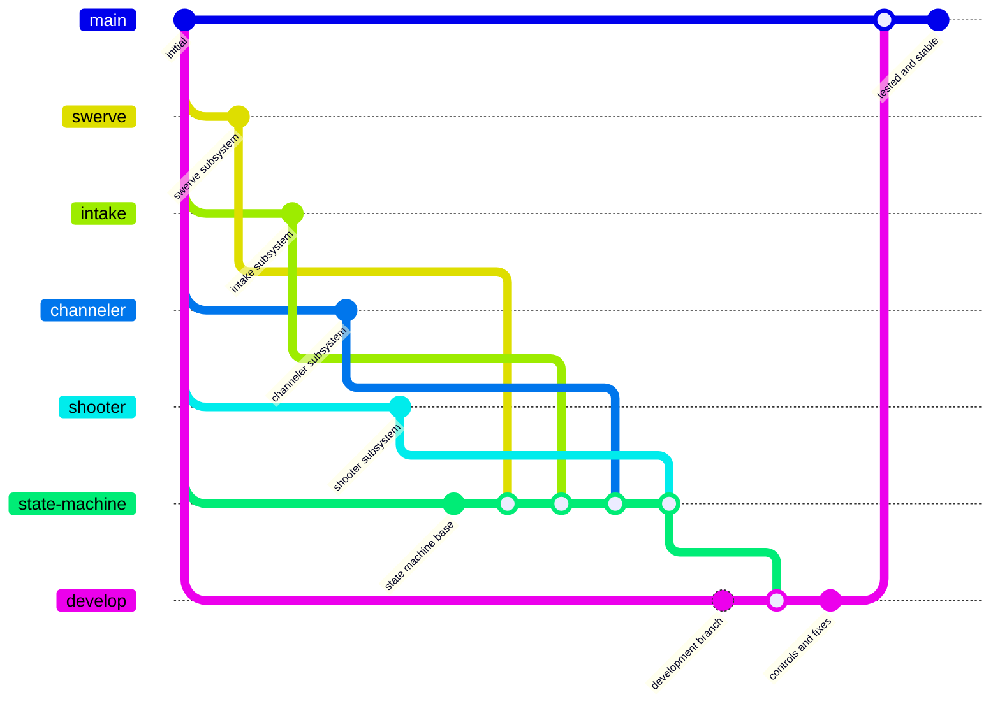
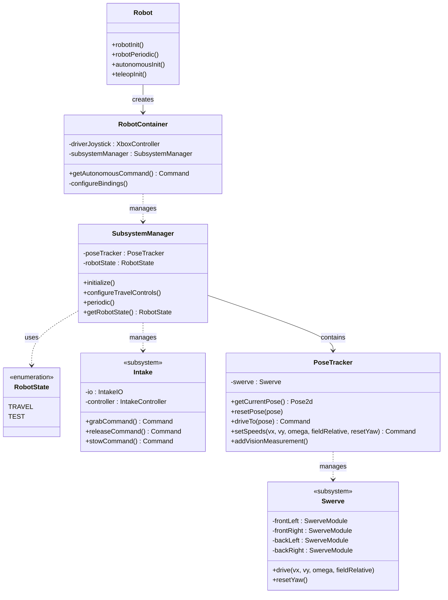
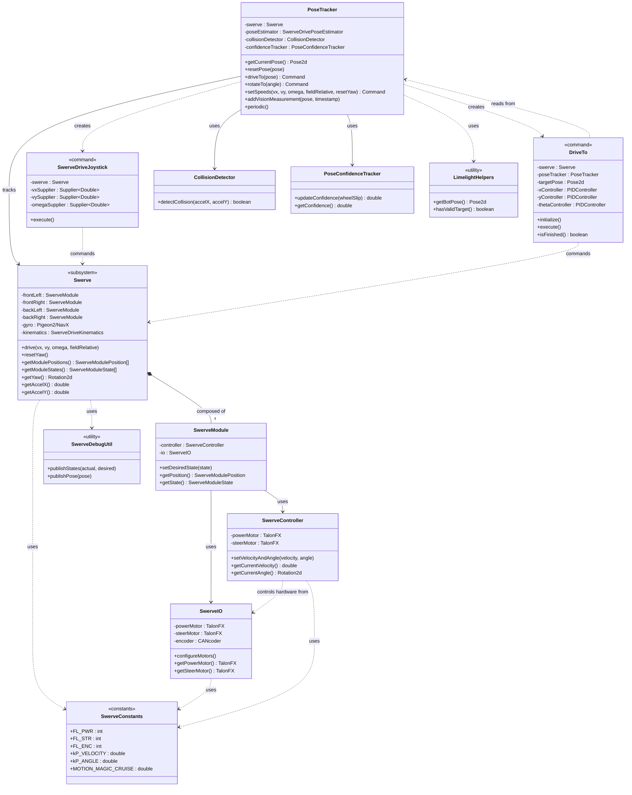
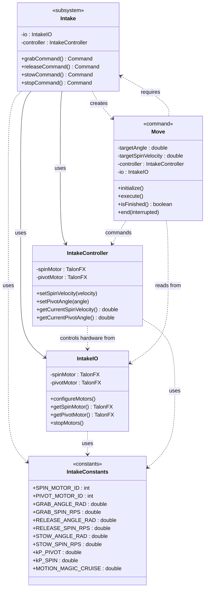

# FRCRebuilt2026-Progra

# Repositorio del Código del Robot

Este repositorio contiene el código fuente del robot, estructurado para permitir el desarrollo paralelo de múltiples subsistemas mientras se mantiene una rama principal estable y probada.

El proyecto sigue una estrategia de ramificación clara diseñada para soportar el aislamiento de subsistemas, la integración segura y las pruebas progresivas en el robot.

---

## Estructura del Repositorio

- Cada subsistema principal del robot se desarrolla independientemente en su propia rama.
- Los subsistemas se integran a través de una máquina de estados centralizada.
- El código progresa a través de etapas de desarrollo y pruebas antes de llegar a producción.

---

## Estrategia de Ramificación

Este repositorio utiliza un modelo de ramificación multi-etapa para garantizar estabilidad y claridad durante todo el desarrollo.

Los subsistemas se desarrollan en paralelo, luego se integran, prueban y validan en etapas claramente definidas.

---

## Descripción de Ramas

### Ramas de Subsistemas
Cada subsistema del robot se desarrolla en su propia rama.

Ejemplos:
- `swerve` (tren motriz / chasis swerve)
- `intake` (mecanismo de entrada/recolección)
- `shooter` (lanzador)
- `climber` (sistema de escalada)

Estas ramas:
- Se enfocan en funcionalidad aislada
- Se utilizan para pruebas a nivel de subsistema
- **NO** deben fusionarse directamente a `develop` o `main`

---

### `state-machine`
Rama de integración donde se fusionan todas las ramas de subsistemas.

Responsabilidades:
- Contiene la máquina de estados del robot
- Integra todos los subsistemas en un flujo único del robot
- Se utiliza para validar las interacciones entre subsistemas

Esta es la **única rama** donde se fusionan las ramas de subsistemas.

---

### `develop`
Rama de estabilización y pruebas.

Responsabilidades:
- Asignación de controles
- Corrección de errores de integración
- Realización de pruebas a nivel de sistema
- Verificación del comportamiento completo del robot

Solo el código que ha sido integrado y validado en `state-machine` se fusiona a `develop`.

---

### `main`
Rama lista para producción.

Responsabilidades:
- Contiene código completamente probado y validado
- Representa la versión estable del robot
- Se utiliza para competencias, demostraciones o lanzamientos

Solo el código que ha pasado las pruebas en `develop` se fusiona a `main`.

---

## Diagrama de Flujo de Ramas

Este diagrama muestra cómo fluye el código desde las ramas de subsistemas individuales hasta la rama principal de producción:



---

## Diagrama de Arquitectura del Código

Esta sección muestra la estructura del código del robot a dos niveles: una vista de alto nivel para entender la arquitectura general, y vistas detalladas de los subsistemas implementados.

### Leyenda de Símbolos:
- **→** (flecha sólida): Asociación directa (una clase "tiene" o "conoce" otra)
- **◇** (diamante): Composición (una clase está "compuesta de" otras)
- **⋯>** (flecha punteada): Dependencia de uso (importaciones, uso de constantes)
- **`<<subsystem>>`**: Subsistemas implementados
- **`<<planned>>`**: Subsistemas planificados aún no implementados

---

### Diagrama de Alto Nivel

Este diagrama muestra la arquitectura general del robot sin entrar en detalles internos de los subsistemas.



#### Explicación Rápida:

- **`Robot`**: Clase principal que inicia todo y ejecuta el loop periódico
- **`RobotContainer`**: Configura subsistemas, controles y comandos
- **`SubsystemManager`**: Gestiona la máquina de estados del robot
- **`Swerve`**: Subsistema del chasis de tracción omnidireccional  **Implementado**
- **`Intake`**: Subsistema de recolección de game pieces  **Implementado**
- **`PoseTracker`**: Estima la posición del robot usando odometría + visión
- **`Constants`**: Almacena todas las constantes (dimensiones, PIDs, etc.)
- **`RobotState`**: Define los modos de operación del robot

---

<details>
<summary><h3> Diagrama Detallado del Subsistema Swerve (Click para expandir)</h3></summary>

Este diagrama muestra la arquitectura interna del subsistema Swerve, incluyendo módulos, controladores y utilidades.



#### Componentes del Subsistema Swerve:

**Capa de Subsistema:**
- **`Swerve`**: Coordina los 4 módulos, gestiona gyro y cinemática del chasis

**Capa de Módulo:**
- **`SwerveModule`**: Representa un módulo swerve individual (rueda + giro)
- **`SwerveController`**: Controla velocidad y ángulo con Motion Magic (Phoenix 6)
- **`SwerveIO`**: Interfaz directa con hardware (TalonFX + CANcoder)

**Comandos:**
- **`SwerveDriveJoystick`**: Comando por defecto - conducción con control Xbox
- **`DriveTo`**: Comando autónomo - navega a una pose específica usando PID holonómico

**Tracking y Estimación:**
- **`PoseTracker`**: Fusiona odometría + visión para estimar pose del robot
- **`PoseConfidenceTracker`**: Detecta patinaje y ajusta confianza en odometría
- **`CollisionDetector`**: Detecta impactos usando acelerómetro del gyro

**Utilidades:**
- **`SwerveConstants`**: IDs de CAN, ganancias PID, parámetros de Motion Magic
- **`LimelightHelpers`**: Comunicación con cámara Limelight (AprilTags)
- **`SwerveDebugUtil`**: Publicación de datos de debug a SmartDashboard

</details>

---

<details>
<summary><h3> Diagrama Detallado del Subsistema Intake (Click para expandir)</h3></summary>

Este diagrama muestra la arquitectura interna del subsistema Intake, siguiendo el mismo patrón que Swerve.



#### Componentes del Subsistema Intake:

**Capa de Subsistema:**
- **`Intake`**: Subsistema principal que coordina la recolección y expulsión de game pieces

**Capa de Control:**
- **`IntakeController`**: Controla los motores de giro (spin) y pivote usando Motion Magic (Phoenix 6)
- **`IntakeIO`**: Interfaz directa con hardware (TalonFX para spin y pivot)

**Comandos:**
- **`Move`**: Comando genérico que mueve el intake a un ángulo específico con una velocidad de giro determinada
  - Usado internamente por `grabCommand()`, `releaseCommand()` y `stowCommand()`

**Constantes:**
- **`IntakeConstants`**: IDs de CAN, ángulos predefinidos, velocidades, ganancias PID y parámetros de Motion Magic

**Modos de Operación:**
- **Grab (Recolectar)**: Pivote baja + giro hacia adentro para recoger game pieces
- **Release (Soltar)**: Pivote sube + giro hacia afuera para expulsar game pieces
- **Stow (Guardar)**: Pivote sube + giro detenido, posición de viaje

</details>

---

### Flujo de Trabajo del Código

#### En Teleoperado (Conducción Manual):
1. **Driver** mueve el joystick del control Xbox
2. **`RobotContainer`** establece el estado travel en **SubsystemManager**
3. **`SwerveDriveJoystick`** lee los ejes del joystick y convierte a velocidades
4. **`Swerve`** recibe las velocidades y las distribuye a los 4 módulos
5. **`PoseTracker`** actualiza continuamente la posición estimada del robot
6. **Operador** puede activar comandos del **`Intake`** (grab, release, stow) mediante botones

#### En Autónomo:
1. **`RobotContainer.getAutonomousCommand()`** devuelve un comando autónomo
2. **`DriveTo`** se ejecuta con una pose objetivo
3. **`PoseTracker`** proporciona la pose actual del robot
4. **`DriveTo`** calcula velocidades necesarias usando PIDs holonómicos
5. **`Swerve`** ejecuta las velocidades calculadas
6. Comandos del **`Intake`** pueden ejecutarse en secuencia o paralelo
7. El comando termina cuando se alcanza la pose objetivo y se completan las acciones

#### Gestión de Estados:
- **`SubsystemManager`** coordina el estado general del robot (`TRAVEL`, etc.)
- Cada subsistema (`Swerve`, `Intake`) puede tener sus propios estados internos
- **`RobotState`** define los modos de operación macro del robot

---

### Organización del Código

```
src/main/java/frc/robot/
├── Robot.java                    # Clase principal del programa
├── RobotContainer.java           # Configuración, subsistemas y bindings
├── SubsystemManager.java         # Máquina de estados del robot
├── RobotState.java               # Enumeración de estados (TRAVEL, etc.)
├── Constants.java                # Constantes globales del proyecto
├── subsystems/
│   ├── swerve/
│   │   ├── Swerve.java           # Subsistema principal del chasis
│   │   ├── SwerveModule.java     # Módulo swerve individual
│   │   ├── SwerveController.java # Control Motion Magic de motores
│   │   ├── SwerveIO.java         # Interfaz de hardware (TalonFX + CANcoder)
│   │   ├── SwerveConstants.java  # Constantes específicas del swerve
│   │   ├── PoseTracker.java      # Estimación de pose (odometría + visión)
│   │   └── commands/
│   │       ├── SwerveDriveJoystick.java  # Conducción manual con joystick
│   │       └── DriveTo.java              # Navegación autónoma a pose
│   └── intake/
│       ├── Intake.java           # Subsistema principal del intake
│       ├── IntakeController.java # Control Motion Magic de motores
│       ├── IntakeIO.java         # Interfaz de hardware (TalonFX spin + pivot)
│       ├── IntakeConstants.java  # Constantes específicas del intake
│       └── commands/
│           └── Move.java         # Comando de movimiento del intake
└── utils/
    ├── CollisionDetector.java        # Detección de impactos
    ├── PoseConfidenceTracker.java    # Detección de patinaje
    ├── LimelightHelpers.java         # Comunicación con Limelight
    └── SwerveDebugUtil.java          # Utilidades de depuración
```

---

## Recursos Adicionales

- [Documentación de WPILib](https://docs.wpilib.org/)
- [Phoenix 6 Documentation (CTRE)](https://pro.docs.ctr-electronics.com/)

---

**Equipo**: FIRST Nautilus 4010  
**Temporada**: 2026  
**Última Actualización**: Febrero 2026
