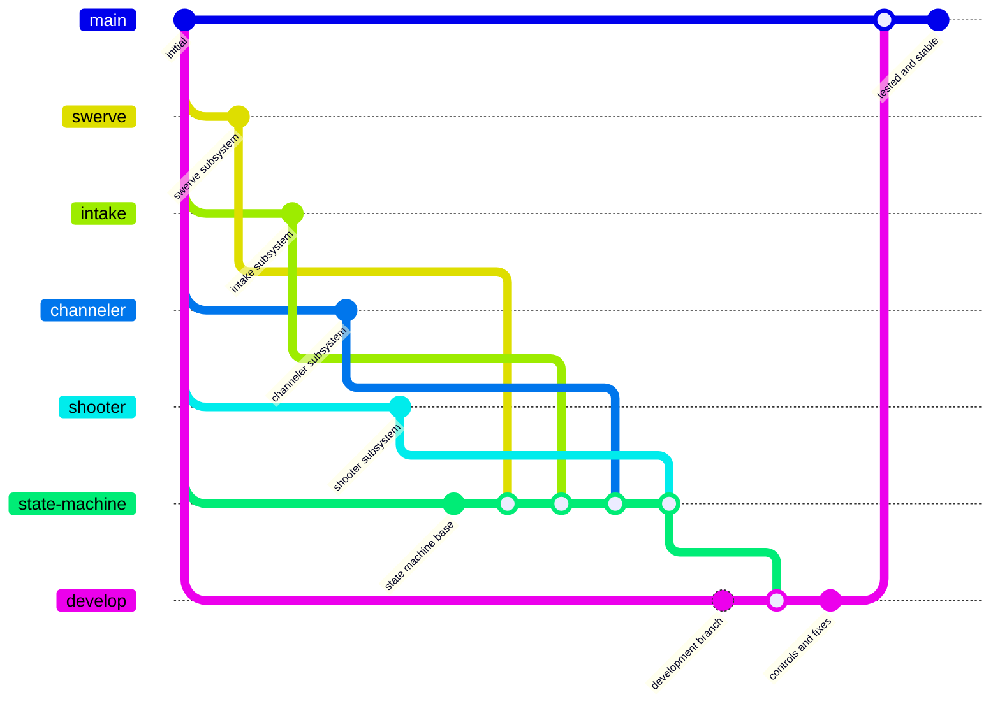
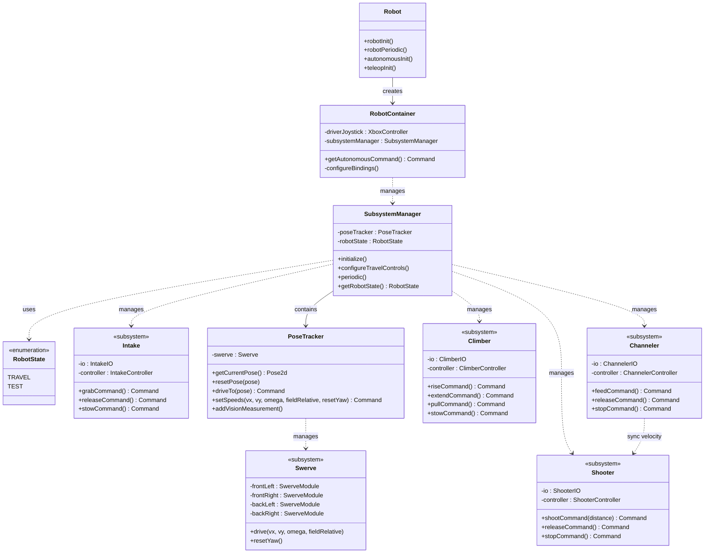
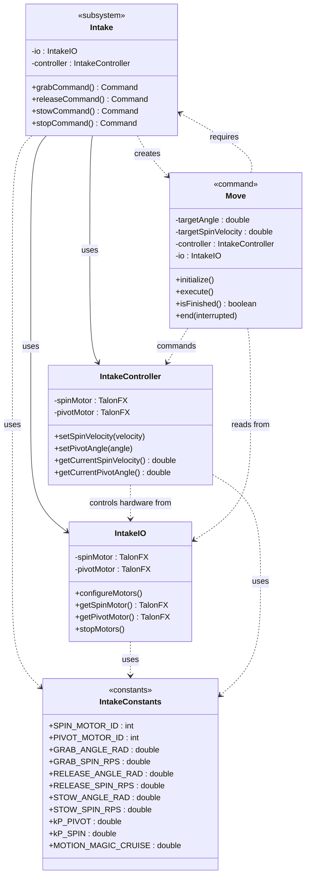
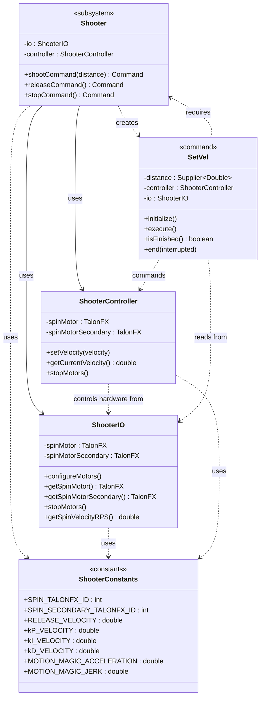
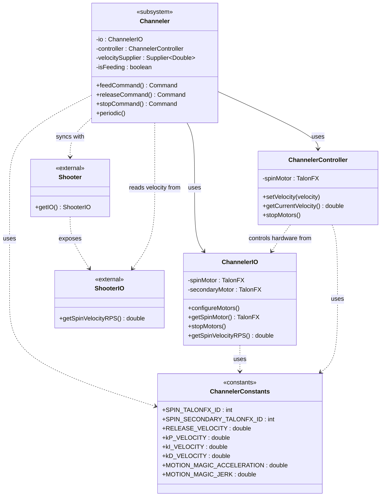
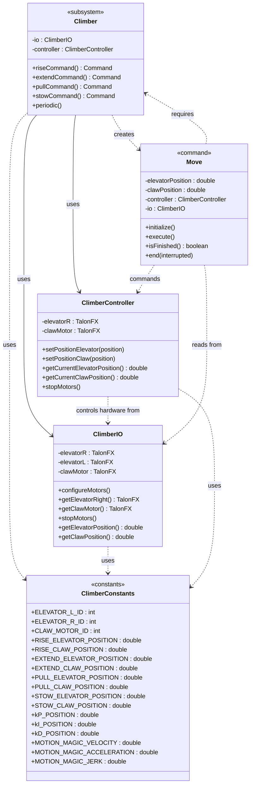

# FRCRebuilt2026-Progra

# Repositorio del Código del Robot

Este repositorio contiene el código fuente del robot, estructurado para permitir el desarrollo paralelo de múltiples subsistemas mientras se mantiene una rama principal estable y probada.

El proyecto sigue una estrategia de ramificación clara diseñada para soportar el aislamiento de subsistemas, la integración segura y las pruebas progresivas en el robot.

---

## Estructura del Repositorio

- Cada subsistema principal del robot se desarrolla independientemente en su propia rama.
- Los subsistemas se integran a través de una máquina de estados centralizada.
- El código progresa a través de etapas de desarrollo y pruebas antes de llegar a producción.

---

## Estrategia de Ramificación

Este repositorio utiliza un modelo de ramificación multi-etapa para garantizar estabilidad y claridad durante todo el desarrollo.

Los subsistemas se desarrollan en paralelo, luego se integran, prueban y validan en etapas claramente definidas.

---

## Descripción de Ramas

### Ramas de Subsistemas
Cada subsistema del robot se desarrolla en su propia rama.

Ejemplos:
- `swerve` (tren motriz / chasis swerve)
- `intake` (mecanismo de entrada/recolección)
- `shooter` (lanzador)
- `climber` (sistema de escalada)

Estas ramas:
- Se enfocan en funcionalidad aislada
- Se utilizan para pruebas a nivel de subsistema
- **NO** deben fusionarse directamente a `develop` o `main`

---

### `state-machine`
Rama de integración donde se fusionan todas las ramas de subsistemas.

Responsabilidades:
- Contiene la máquina de estados del robot
- Integra todos los subsistemas en un flujo único del robot
- Se utiliza para validar las interacciones entre subsistemas

Esta es la **única rama** donde se fusionan las ramas de subsistemas.

---

### `develop`
Rama de estabilización y pruebas.

Responsabilidades:
- Asignación de controles
- Corrección de errores de integración
- Realización de pruebas a nivel de sistema
- Verificación del comportamiento completo del robot

Solo el código que ha sido integrado y validado en `state-machine` se fusiona a `develop`.

---

### `main`
Rama lista para producción.

Responsabilidades:
- Contiene código completamente probado y validado
- Representa la versión estable del robot
- Se utiliza para competencias, demostraciones o lanzamientos

Solo el código que ha pasado las pruebas en `develop` se fusiona a `main`.

---

## Arquitectura del Robot - Temporada 2026

Este robot está diseñado para competir en la temporada 2026 de FRC, con el objetivo de recopilar y lanzar **fuel** hacia objetivos específicos en el campo.

### Filosofía de Diseño

- **Modular:** Cada subsistema es independiente y autocontenido
- **Escalable:** Fácil de extender con nuevas características
- **Probado:** Integración progresiva con validación en cada etapa
- **Documentado:** Código comentado profesionalmente y con referencias cruzadas

---

## Subsistemas Principales

### 1. **Swerve Drive**
**Archivos:** `Swerve.java`, `SwerveModule.java`, `SwerveConstants.java`

Sistema de transmisión tipo swerve con 4 módulos independientes (delantero izquierdo, delantero derecho, trasero izquierdo, trasero derecho).

**Características:**
- Dual IMU: Pigeon2 (principal) + NavX (backup)
- Velocidad máxima: 3.9 m/s
- Velocidad angular máxima: 4.79π rad/s
- Odometría en tiempo real para localización
- Control field-relative y robot-relative

**Control:**
```
Joystick izquierdo XY → Velocidad lineal (X, Y)
Joystick derecho X → Velocidad angular (theta)
```

---

### 2. **Pose Tracker (Estimador de Pose)**
**Archivos:** `PoseTracker.java`, `PoseConfidenceTracker.java`

Sistema centralizado de estimación de posición del robot que fusiona múltiples fuentes de información.

**Características:**
- Odometría swerve como base continua
- Fusión de visión con AprilTags mediante Limelight
- Cámaras Limelight: `limelight-comosea` (principal), `limelight-three` (secundaria)
- Detección de colisiones automática
- Seguimiento de confianza de pose
- Validación de mediciones de visión antes de aplicarlas
- Smart crop para optimización de detección

**Métodos clave:**
- `getPose()` → Pose2d actual del robot
- `processVision()` → Integra lecturas de AprilTags
- `visionGate()` → Valida confiabilidad de mediciones
- `resetPose()` → Resetea estimador a pose específica

---

### 3. **Intake (Sistema de Recolección)**
**Archivos:** `Intake.java`, `IntakeIO.java`, `IntakeController.java`, `IntakeConstants.java`

Mecanismo de entrada para recopilar fuel del campo. Consta de un pivote y dos motores de giro (spinners).

**Componentes:**
- **Pivote:** Posicionamiento angular mediante Motion Magic Expo
  - Rango: 0 a -2.9 radianes
  - Control sincronizado (motor L/R con alineación opuesta)
- **Spinners:** Dos motores de giro independientes (frontal y trasero)
  - Control de velocidad mediante Motion Magic Velocity
  - Velocidad máxima: configurable

**Operaciones predefinidas:**
- **GRAB:** Pivote a -2.850 rad, spinners a -70/-30 RPS (recolectar fuel)
- **RELEASE:** Pivote a -2.850 rad, spinners a +30/+30 RPS (expulsar fuel)
- **STOW:** Pivote a 0 rad, spinners a 0 RPS (guardar/reposo)

**Ganancias PID (Motion Magic):**
- kS = 0.10442, kV = 0.10882, kA = 0.001647
- kP = 0.4, kI = 0.0, kD = 0.001

**Comando:** `Move` → Posiciona pivote y configura velocidades de spinners

---

### 4. **Channeler (Sistema de Conducción)**
**Archivos:** `Channeler.java`, `ChannelerIO.java`, `ChannelerController.java`, `ChannelerConstants.java`

Subsistema de transporte que conduce el fuel desde el intake hacia el shooter. Consta de un motor spinner sincronizado.

**Componentes:**
- Motor principal (TalonFX ID: 6)
- Motor secundario en modo follower (TalonFX ID: 7)
- Control de velocidad mediante Motion Magic Velocity

**Operaciones:**
- **FEED:** Alimenta fuel al shooter sincronizado con su velocidad actual
- **RELEASE:** Expulsa fuel a 30 RPS
- **STOP:** Detiene el motor

**Ganancias PID:**
- kS = 0.10442, kV = 0.10882, kA = 0.001647
- kP = 0.4, kI = 0.0, kD = 0.001

---

### 5. **Shooter (Sistema de Lanzamiento)**
**Archivos:** `Shooter.java`, `ShooterIO.java`, `ShooterController.java`, `ShooterConstants.java`

Sistema de propulsión que lanza fuel hacia los objetivos del campo. Consta de dos motores sincronizados.

**Componentes:**
- Motor principal (TalonFX ID: 8)
- Motor secundario en modo follower con alineación opuesta (TalonFX ID: 9)
- Control de velocidad mediante Motion Magic Velocity

**Operaciones:**
- **SHOOT:** Calcula velocidad basada en distancia al objetivo
- **RELEASE:** Lanza a velocidad predeterminada (-10 RPS)
- **STOP:** Detiene el motor

**Ganancias PID:**
- kS = 0.10442, kV = 0.10882, kA = 0.001647
- kP = 0.4, kI = 0.0, kD = 0.001
- Velocidad de liberación: -10.0 RPS

---

### 6. **Climber (Sistema de Escalada)**
**Archivos:** `Climber.java`, `ClimberIO.java`, `ClimberController.java`, `ClimberConstants.java`

Sistema de escalada para que el robot ascienda por cadenas al final del partido.

**Componentes:**
- **Elevador:** Dos motores sincronizados (izquierdo/derecho)
  - Rango: 0 a -2.584 rotaciones
  - Control mediante Motion Magic Expo
- **Garra:** Motor individual de la garra de sujeción
  - Rango: 0 a -2.584 rotaciones
  - Control mediante Motion Magic Expo

**Etapas de Escalada (posiciones predefinidas):**
- **RISE:** Sube el elevador y extiende la garra (etapa inicial)
- **EXTEND:** Extiende elevador y garra (segunda etapa)
- **PULL:** Tira hacia arriba para preparar tercera etapa
- **STOW:** Retrae y guarda el sistema

**Ganancias PID:**
- Velocidad Motion Magic: 9 rot/s
- Aceleración: 10 rot/s²
- Jerk: 9500 rot/s³
- kP = 0.05, kI = 0.0, kD = 0.002

**Comando:** `Move` → Secuencia el movimiento de elevador y garra con tolerancia de 0.05 rotaciones

---

## Máquina de Estados del Robot

**SubsystemManager** coordina todos los subsistemas a través de una máquina de estados centralizada.

### Estados Operacionales:

```
┌─────────────────────────────────────────────────────────┐
│                    ROBOT STATES                         │
├─────────────────────────────────────────────────────────┤
│                                                         │
│  TRAVEL        → Conducción normal con joystick        │
│  ├─ Swerve activo (control field-relative)             │
│  ├─ Intake stow                                         │
│  └─ Shooter/Channeler inactivos                        │
│                                                         │
│  INTAKE        → Recolección de fuel                    │
│  ├─ Swerve activo (conducción limitada)               │
│  ├─ Intake grab activo                                 │
│  └─ Channeler alimentando                              │
│                                                         │
│  SHOOT         → Lanzamiento de fuel                    │
│  ├─ Swerve activo (aiming automático opcional)         │
│  ├─ Intake stow                                         │
│  ├─ Shooter activo (velocidad calculada o predefinida) │
│  └─ Channeler sincronizado con shooter                 │
│                                                         │
│  CLIMB         → Escalada                              │
│  ├─ Swerve limitado                                    │
│  └─ Climber ejecutando secuencia de ascenso            │
│                                                         │
│  TEST          → Modo de prueba/diagnóstico            │
│  └─ Subsistemas individuales controlables              │
│                                                         │
└─────────────────────────────────────────────────────────┘
```

### Transiciones de Estado (RobotContainer):

| Botón Xbox    | Acción                          | Nuevo Estado |
|---------------|---------------------------------|--------------|
| A             | Reset Giroscopio               | Mantiene     |
| Y             | Cambiar a TEST                  | TEST         |
| X             | Cambiar a TRAVEL               | TRAVEL       |
| B             | Cambiar a CLIMB                | CLIMB        |
| LT (Trigger L)| Cambiar a INTAKE               | INTAKE       |
| RT (Trigger R)| Cambiar a SHOOT                | SHOOT        |

---

## Estructura de Archivos

```
src/main/java/frc/robot/
│
├── Main.java                          → Punto de entrada del robot
├── Robot.java                         → Ciclo de vida de FRC
├── RobotContainer.java                → Configuración central y bindings
├── RobotState.java                    → Enum de estados
├── SubsystemManager.java              → Gestor de máquina de estados
├── Constants.java                     → Constantes globales
│
├── autonomous/
│   └── AutoIdeal.java                 → Rutina autónoma
│
├── subsystems/
│   ├── swerve/
│   │   ├── Swerve.java                → Subsistema de conducción
│   │   ├── SwerveModule.java          → Módulo individual
│   │   ├── SwerveConstants.java       → Constantes de configuración
│   │   ├── PoseTracker.java           → Estimador de pose + visión
│   │   └── commands/
│   │       ├── Drive.java             → Comando de conducción
│   │       └── DriveTo.java           → Conducción autónoma a pose
│   │
│   ├── intake/
│   │   ├── Intake.java                → Subsistema de recolección
│   │   ├── IntakeIO.java              → Interfaz de hardware
│   │   ├── IntakeController.java      → Controlador de motores
│   │   ├── IntakeConstants.java       → Constantes de configuración
│   │   └── commands/
│   │       └── Move.java              → Comando de movimiento
│   │
│   ├── shooter/
│   │   ├── Shooter.java               → Subsistema de lanzamiento
│   │   ├── ShooterIO.java             → Interfaz de hardware
│   │   ├── ShooterController.java     → Controlador de motores
│   │   ├── ShooterConstants.java      → Constantes de configuración
│   │   └── commands/
│   │       └── SetVel.java            → Comando de velocidad
│   │
│   ├── channeler/
│   │   ├── Channeler.java             → Subsistema de conducción
│   │   ├── ChannelerIO.java           → Interfaz de hardware
│   │   ├── ChannelerController.java   → Controlador de motores
│   │   └── ChannelerConstants.java    → Constantes de configuración
│   │
│   └── climber/
│       ├── Climber.java               → Subsistema de escalada
│       ├── ClimberIO.java             → Interfaz de hardware
│       ├── ClimberController.java     → Controlador de motores
│       ├── ClimberConstants.java      → Constantes de configuración
│       └── commands/
│           └── Move.java              → Comando de movimiento
│
└── utils/
    ├── LimelightHelpers.java          → Integración con Limelight
    ├── PoseConfidenceTracker.java     → Tracking de confianza de pose
    ├── CollisionDetector.java         → Detección de colisiones
    ├── SwerveDebugUtil.java           → Utilidades de debug
    └── TejuinoBoard.java              → Controlador de LEDs

```

---

## Patrones de Control

### Patrón IO (Hardware Abstraction)

Cada subsistema tiene una clase `IO` que encapsula toda la interacción con hardware:

```java
// Ejemplo: IntakeIO
public class IntakeIO {
    private final TalonFX spinBackMotor;
    private final TalonFX pivotMotor;
    
    public double getPivotPositionRad() { /* ... */ }
    public double getSpinVelocityRPS() { /* ... */ }
    public void stopMotors() { /* ... */ }
}
```

**Ventajas:**
- Facilita pruebas sin hardware
- Simplifica cambios de hardware
- Encapsula configuración de CAN

---

### Patrón Controller (Configuración y Control)

Cada subsistema tiene un `Controller` que gestiona configuración y envía comandos:

```java
// Ejemplo: IntakeController
public class IntakeController {
    private final TalonFX spinBackMotor;
    private final MotionMagicVelocityVoltage velocityRequest;
    
    public void setVelocity(double rps) { /* ... */ }
    public void setAngle(double radians) { /* ... */ }
}
```

**Responsabilidades:**
- Aplica ganancias PID
- Configura Motion Magic
- Gestiona requests de control

---

### Patrón Command (Comandos de Operación)

Operaciones del robot se implementan como `Commands` que pueden ser:
- Instantes (ejecutan en 1 ciclo)
- Continuos (requieren múltiples ciclos)
- Secuenciales (se encadenan)

```java
// Ejemplo: Intake Move Command
public Command grabCommand() {
    return new Move(
        GRAB_ANGLE_RAD,           // ángulo objetivo
        GRAB_SPIN_RPS,            // velocidad spinner
        controller, io, this
    );
}
```

---

## Configuración de Hardware

### Dispositivos CAN (TalonFX)

| Subsistema | Motor              | CAN ID | Función                 |
|------------|-------------------|--------|-------------------------|
| Intake    | Pivote L           | 1      | Posicionamiento pivote  |
| Intake    | Pivote R           | 2      | Posicionamiento pivote  |
| Intake    | Spinner Frontal    | 3      | Giro frontal            |
| Intake    | Spinner Trasero    | 4      | Giro trasero            |
| Channeler | Spinner Principal  | 6      | Conducción de fuel      |
| Channeler | Spinner Secundario | 7      | Seguidor                |
| Shooter   | Spinner Principal  | 8      | Lanzamiento             |
| Shooter   | Spinner Secundario | 9      | Seguidor                |
| Climber   | Garra              | 10     | Agarre de cadena        |
| Climber   | Elevador L         | 11     | Levantamiento           |
| Climber   | Elevador R         | 12     | Levantamiento           |

### Sensores

| Sensor      | Conexión | Función                           |
|-------------|----------|-----------------------------------|
| Pigeon2     | CAN      | Giroscopio principal              |
| NavX        | SPI/MXP  | Giroscopio de backup              |
| Limelight 1 | Ethernet | Odometría visual (comosea)        |
| Limelight 2 | Ethernet | Visión secundaria (three)         |

### Controlador

| Dispositivo | Puerto   | Función              |
|-------------|----------|----------------------|
| Xbox Controller | USB 0 | Control del operador |

---

## Parámetros de Control Clave

### Motion Magic (Movimiento Suave)

Todos los subsistemas usan Motion Magic para movimiento controlado:

```
Motion Magic Expo (Posición)     | Motion Magic Velocity (Velocidad)
────────────────────────────────┼───────────────────────────────
Intake:                         | Shooter/Channeler:
  Vel: 9 rot/s                  |   Accel: 950 rot/s²
  Accel: 10 rot/s²              |   Jerk: 9500 rot/s³
  Jerk: 9500 rot/s³             |   kV: 0.10882
  kV Expo: 0.12                 |   kA: 0.001647
                                |
Climber:                        |
  Vel: 9 rot/s                  |
  Accel: 10 rot/s²              |
  Jerk: 9500 rot/s³             |
```

### PID Sintonizado

Todos los subsistemas comparten ganancias optimizadas (excepto climber):

```
Feed-forward:              PID Feedback:
  kS: 0.10442              kP: 0.4
  kV: 0.10882              kI: 0.0
  kA: 0.001647             kD: 0.001

Climber (posición):
  kP: 0.05, kI: 0.0, kD: 0.002
```

---

## Compilación y Ejecución

### Requisitos

- **Java:** 17+
- **Gradle:** 8.0+
- **FRC Tools:** WPILib 2026
- **Dependencies:**
  - CTRE Phoenix6 26.1.1
  - WPILib NewCommands
  - Studica NavX

### Compilación

```powershell
# Compilar proyecto
./gradlew build

# Compilar y desplegar
./gradlew deploy

# Limpiar build
./gradlew clean
```

### Modo Debug

El robot incluye múltiples puntos de telemetría:

- **SmartDashboard:** Datos en tiempo real (velocidad, posición, estado)
- **NetworkTables:** Pose del robot, confianza de visión
- **Limelight Dashboard:** Visión en tiempo real

---

## Convenciones de Codificación

### Nomenclatura

- **Clases:** PascalCase (`IntakeController`, `ShooterIO`)
- **Métodos/Variables:** camelCase (`getPivotPosition`, `isFeeding`)
- **Constantes:** UPPER_SNAKE_CASE (`GRAB_ANGLE_RAD`, `MAX_VELOCITY`)

### Documentación

Todo el código incluye comentarios Javadoc profesionales:

```java
/**
 * Descripción breve del método.
 *
 * Descripción detallada si es necesaria.
 *
 * @param parameter Descripción del parámetro
 * @return Descripción del valor retornado
 */
public void methodName(String parameter) { /* ... */ }
```

### Estructura de Métodos

En cada subsistema:
1. Métodos públicos de API
2. Métodos privados de configuración
3. Métodos periódicos (telemetría)

---

## Testing

### A Nivel de Subsistema

Cada subsistema se prueba independientemente en su rama:
- Rango de movimiento
- Sincronización de motores
- Respuesta de sensores

### A Nivel de Integración

En `state-machine` se valida:
- Transiciones de estado
- Interacción entre subsistemas
- Tolerancias y convergencia

### A Nivel de Sistema

En `develop` se verifica:
- Comportamiento completo del robot
- Mapeo de controles
- Desempeño en campo

---

## Troubleshooting

### El robot no responde a comandos

1. Verificar conexión CAN de los TalonFX
2. Revisar IDs de dispositivos en Constants
3. Confirmar que SubsystemManager está inicializado

### Pose del robot es inexacta

1. Revisar calibración de Limelight
2. Confirmar que AprilTags son visibles
3. Revisar confianza de pose en SmartDashboard

### Motor se mueve erraticamente

1. Revisar ganancias PID en Constants
2. Verificar que el motor no está en reverse mode involuntariamente
3. Comprobar límites de software (soft limits)

---

## Contribución

Al contribuir a este repositorio:

1. **Crea una rama de feature** desde `develop`
2. **Desarrolla y prueba** tu funcionalidad
3. **Documenta** cambios importantes
4. **Abre un Pull Request** hacia `develop`
5. **Espera revisión** antes de merging

---

## Licencia

Este proyecto está bajo la Licencia WPILib BSD. Ver `WPILib-License.md` para detalles.

---

**Última actualización:** Marzo 2026

## Diagrama de Flujo de Ramas

Este diagrama muestra cómo fluye el código desde las ramas de subsistemas individuales hasta la rama principal de producción:



---

## Diagrama de Arquitectura del Código

Esta sección muestra la estructura del código del robot a dos niveles: una vista de alto nivel para entender la arquitectura general, y vistas detalladas de los subsistemas implementados.

### Leyenda de Símbolos:
- **→** (flecha sólida): Asociación directa (una clase "tiene" o "conoce" otra)
- **◇** (diamante): Composición (una clase está "compuesta de" otras)
- **⋯>** (flecha punteada): Dependencia de uso (importaciones, uso de constantes)
- **`<<subsystem>>`**: Subsistemas implementados
- **`<<planned>>`**: Subsistemas planificados aún no implementados

---

### Diagrama de Alto Nivel

Este diagrama muestra la arquitectura general del robot sin entrar en detalles internos de los subsistemas.



#### Explicación Rápida:

- **`Robot`**: Clase principal que inicia todo y ejecuta el loop periódico
- **`RobotContainer`**: Configura subsistemas, controles y comandos
- **`SubsystemManager`**: Gestiona la máquina de estados del robot
- **`Swerve`**: Subsistema del chasis de tracción omnidireccional  **Implementado**
- **`Intake`**: Subsistema de recolección de game pieces  **Implementado**
- **`PoseTracker`**: Estima la posición del robot usando odometría + visión
- **`Constants`**: Almacena todas las constantes (dimensiones, PIDs, etc.)
- **`RobotState`**: Define los modos de operación del robot

---

<details>
<summary><h3> Diagrama Detallado del Subsistema Swerve (Click para expandir)</h3></summary>

Este diagrama muestra la arquitectura interna del subsistema Swerve, incluyendo módulos, controladores y utilidades.


#### Componentes del Subsistema Swerve:

**Capa de Subsistema:**
- **`Swerve`**: Coordina los 4 módulos, gestiona gyro y cinemática del chasis

**Capa de Módulo:**
- **`SwerveModule`**: Representa un módulo swerve individual (rueda + giro)
- **`SwerveController`**: Controla velocidad y ángulo con Motion Magic (Phoenix 6)
- **`SwerveIO`**: Interfaz directa con hardware (TalonFX + CANcoder)

**Comandos:**
- **`SwerveDriveJoystick`**: Comando por defecto - conducción con control Xbox
- **`DriveTo`**: Comando autónomo - navega a una pose específica usando PID holonómico

**Tracking y Estimación:**
- **`PoseTracker`**: Fusiona odometría + visión para estimar pose del robot
- **`PoseConfidenceTracker`**: Detecta patinaje y ajusta confianza en odometría
- **`CollisionDetector`**: Detecta impactos usando acelerómetro del gyro

**Utilidades:**
- **`SwerveConstants`**: IDs de CAN, ganancias PID, parámetros de Motion Magic
- **`LimelightHelpers`**: Comunicación con cámara Limelight (AprilTags)
- **`SwerveDebugUtil`**: Publicación de datos de debug a SmartDashboard

</details>

---

<details>
<summary><h3> Diagrama Detallado del Subsistema Intake (Click para expandir)</h3></summary>

Este diagrama muestra la arquitectura interna del subsistema Intake, siguiendo el mismo patrón que Swerve.



#### Componentes del Subsistema Intake:

**Capa de Subsistema:**
- **`Intake`**: Subsistema principal que coordina la recolección y expulsión de fuel

**Capa de Control:**
- **`IntakeController`**: Controla los motores de giro (spin) y pivote usando Motion Magic (Phoenix 6)
- **`IntakeIO`**: Interfaz directa con hardware (TalonFX para spin y pivot)

**Comandos:**
- **`Move`**: Comando genérico que mueve el intake a un ángulo específico con una velocidad de giro determinada
  - Usado internamente por `grabCommand()`, `releaseCommand()` y `stowCommand()`

**Constantes:**
- **`IntakeConstants`**: IDs de CAN, ángulos predefinidos, velocidades, ganancias PID y parámetros de Motion Magic

**Modos de Operación:**
- **Grab (Recolectar)**: Pivote baja + giro hacia adentro para recoger fuel
- **Release (Soltar)**: Pivote sube + giro hacia afuera para expulsar fuel
- **Stow (Guardar)**: Pivote sube + giro detenido, posición de viaje

</details>

---

<details>
<summary><h3> Diagrama Detallado del Subsistema Shooter (Click para expandir)</h3></summary>

Este diagrama muestra la arquitectura interna del subsistema Shooter para lanzamiento de fuel.



#### Componentes del Subsistema Shooter:

**Capa de Subsistema:**
- **`Shooter`**: Subsistema principal que coordina el lanzamiento de fuel

**Capa de Control:**
- **`ShooterController`**: Controla los motores de giro sincronizados usando Motion Magic Velocity (Phoenix 6)
- **`ShooterIO`**: Interfaz directa con hardware (dos TalonFX sincronizados con alineación opuesta)

**Comandos:**
- **`SetVel`**: Comando que establece la velocidad del lanzador basada en distancia al objetivo
  - Lee distancia de un `Supplier<Double>` (típicamente desde `PoseTracker` y AprilTag)
  - Calcula velocidad necesaria (puede ser polinomio o tabla de lookup)
  - Se completa cuando alcanza velocidad objetivo

**Constantes:**
- **`ShooterConstants`**: IDs de CAN, velocidad de liberación predefinida, ganancias PID, parámetros de Motion Magic

**Modos de Operación:**
- **Shoot (Disparar)**: Calcula velocidad dinámicamente basada en distancia
- **Release (Liberar)**: Lanza a velocidad predeterminada (-10.0 RPS)
- **Stop (Parar)**: Detiene ambos motores

**Sincronización:**
- Motores principal y secundario están sincronizados con alineación opuesta (uno gira en sentido contrario)
- Esto asegura que el fuel salga recto (sin rotación lateral)

</details>

---

<details>
<summary><h3> Diagrama Detallado del Subsistema Channeler (Click para expandir)</h3></summary>

Este diagrama muestra la arquitectura interna del subsistema Channeler para transporte de fuel.



#### Componentes del Subsistema Channeler:

**Capa de Subsistema:**
- **`Channeler`**: Subsistema principal que transporta fuel desde intake hacia shooter
- Contiene `velocitySupplier` para sincronización con shooter
- Flag `isFeeding` controla si debe alimentar o no

**Capa de Control:**
- **`ChannelerController`**: Controla el motor de giro usando Motion Magic Velocity (Phoenix 6)
- **`ChannelerIO`**: Interfaz directa con hardware (dos TalonFX sincronizados en alineación)

**Constantes:**
- **`ChannelerConstants`**: IDs de CAN, velocidad de liberación (30 RPS), ganancias PID, parámetros de Motion Magic

**Modos de Operación:**
- **Feed (Alimentar)**: Lector la velocidad del shooter y sincroniza a esa velocidad
  - Si shooter está a 0 RPS, channeler también es 0
  - Si shooter acelera, channeler acelera al mismo ritmo
- **Release (Liberar)**: Expulsa fuel a 30 RPS (velocidad inversa a shooter)
- **Stop (Parar)**: Detiene el motor

**Sincronización:**
- Motores principal y secundario están sincronizados con alineación normal
- Ambos giran en la misma dirección para transportar fuel

**Integración con Shooter:**
- `velocitySupplier` proviene de `Shooter::getIO()::getSpinVelocityRPS()`
- En `periodic()`, calcula velocidad sincronizada = `shooterVelocity - offset`
- Permite que fuel fluya suavemente desde intake → channeler → shooter

</details>

---

<details>
<summary><h3> Diagrama Detallado del Subsistema Climber (Click para expandir)</h3></summary>

Este diagrama muestra la arquitectura interna del subsistema Climber para escalada.



#### Componentes del Subsistema Climber:

**Capa de Subsistema:**
- **`Climber`**: Subsistema principal que coordina la escalada del robot en las cadenas

**Capa de Control:**
- **`ClimberController`**: Controla los motores del elevador (sincronizado) y garra usando Motion Magic Expo (Phoenix 6)
- **`ClimberIO`**: Interfaz directa con hardware
  - Elevador: motor derecho (principal) + motor izquierdo (seguidor sincronizado)
  - Garra: motor individual
  - Todos TalonFX

**Comandos:**
- **`Move`**: Comando genérico que mueve elevador y garra a posiciones específicas
  - Verifica tolerancia de 0.05 rotaciones antes de completarse
  - Se usa internamente por `riseCommand()`, `extendCommand()`, `pullCommand()` y `stowCommand()`

**Constantes:**
- **`ClimberConstants`**: IDs de CAN, posiciones predefinidas para cada etapa, ganancias PID, parámetros de Motion Magic

**Etapas de Escalada:**

| Etapa  | Elevador | Garra | Descripción |
|--------|----------|-------|-------------|
| **RISE** | -0.5 rot | -0.2 rot | Enganche inicial en cadena, sube ligeramente |
| **EXTEND** | -1.5 rot | -1.0 rot | Extiende elevador y garra para alcanzar siguiente nivel |
| **PULL** | -2.0 rot | -1.8 rot | Tira hacia arriba para preparar tercer nivel |
| **STOW** | 0 rot | 0 rot | Retrae completamente, posición de reposo |

**Características:**
- Sincronización del elevador L/R para evitar desalineamiento
- Motion Magic Expo para movimiento suave y controlado
- Posiciones predefinidas para secuencia de escalada confiable
- Tolerancia de convergencia de 0.05 rotaciones

**Notas de Seguridad:**
- Siempre termina con `stowCommand()` para evitar daños en mecanismo
- Elevador tiene soft limits para evitar sobre-extensión
- Garra tiene soft limits para evitar sobrecarga

</details>

---

### Flujo de Trabajo del Código

#### En Teleoperado (Conducción Manual):
1. **Driver** mueve el joystick del control Xbox
2. **`RobotContainer`** establece el estado travel en **SubsystemManager**
3. **`SwerveDriveJoystick`** lee los ejes del joystick y convierte a velocidades
4. **`Swerve`** recibe las velocidades y las distribuye a los 4 módulos
5. **`PoseTracker`** actualiza continuamente la posición estimada del robot
6. **Operador** puede activar comandos del **`Intake`** (grab, release, stow) mediante botones

#### En Autónomo:
1. **`RobotContainer.getAutonomousCommand()`** devuelve un comando autónomo
2. **`DriveTo`** se ejecuta con una pose objetivo
3. **`PoseTracker`** proporciona la pose actual del robot
4. **`DriveTo`** calcula velocidades necesarias usando PIDs holonómicos
5. **`Swerve`** ejecuta las velocidades calculadas
6. Comandos del **`Intake`** pueden ejecutarse en secuencia o paralelo
7. El comando termina cuando se alcanza la pose objetivo y se completan las acciones

#### Gestión de Estados:
- **`SubsystemManager`** coordina el estado general del robot (`TRAVEL`, etc.)
- Cada subsistema (`Swerve`, `Intake`) puede tener sus propios estados internos
- **`RobotState`** define los modos de operación macro del robot

---

### Organización del Código

```
src/main/java/frc/robot/
├── Robot.java                    # Clase principal del programa
├── RobotContainer.java           # Configuración, subsistemas y bindings
├── SubsystemManager.java         # Máquina de estados del robot
├── RobotState.java               # Enumeración de estados (TRAVEL, etc.)
├── Constants.java                # Constantes globales del proyecto
├── subsystems/
│   ├── swerve/
│   │   ├── Swerve.java           # Subsistema principal del chasis
│   │   ├── SwerveModule.java     # Módulo swerve individual
│   │   ├── SwerveController.java # Control Motion Magic de motores
│   │   ├── SwerveIO.java         # Interfaz de hardware (TalonFX + CANcoder)
│   │   ├── SwerveConstants.java  # Constantes específicas del swerve
│   │   ├── PoseTracker.java      # Estimación de pose (odometría + visión)
│   │   └── commands/
│   │       ├── SwerveDriveJoystick.java  # Conducción manual con joystick
│   │       └── DriveTo.java              # Navegación autónoma a pose
│   └── intake/
│       ├── Intake.java           # Subsistema principal del intake
│       ├── IntakeController.java # Control Motion Magic de motores
│       ├── IntakeIO.java         # Interfaz de hardware (TalonFX spin + pivot)
│       ├── IntakeConstants.java  # Constantes específicas del intake
│       └── commands/
│           └── Move.java         # Comando de movimiento del intake
└── utils/
    ├── CollisionDetector.java        # Detección de impactos
    ├── PoseConfidenceTracker.java    # Detección de patinaje
    ├── LimelightHelpers.java         # Comunicación con Limelight
    └── SwerveDebugUtil.java          # Utilidades de depuración
```

---

## Recursos Adicionales

- [Documentación de WPILib](https://docs.wpilib.org/)
- [Phoenix 6 Documentation (CTRE)](https://pro.docs.ctr-electronics.com/)

---

**Equipo**: FIRST Nautilus 4010  
**Temporada**: 2026  
**Última Actualización**: Marzo 2026
